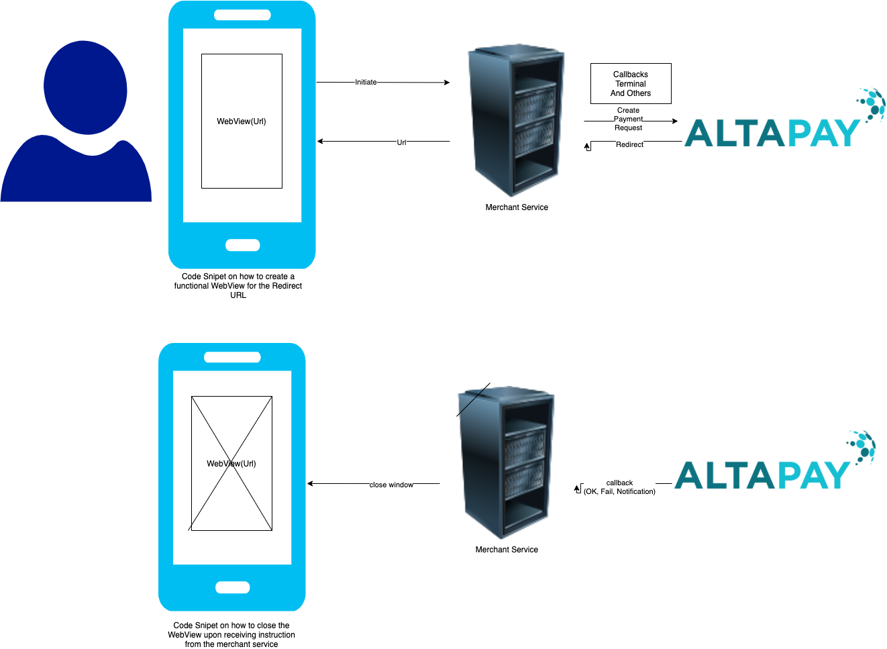

# AltaPay for Android APP

The project contains a set of examples of how to display our payment page in an android native app

## Usage

- Add permission of internet in the manifest file.
- Implement the required dependencies
- Create PaymentRequestHelper object
    ```PaymentRequestHelper helper = new PaymentRequestHelper(ActivityName.this);```
- To open or close the webview create the object of ```PaymentWebView``` class



## Requirenment
The AltaPay Android APP requires following libraries to installed:
- com.android.volley:volley:1.2.1
- com.google.code.gson:gson:2.8.8

## License

Distributed under the MIT License. See [LICENSE](LICENSE) for more information.

